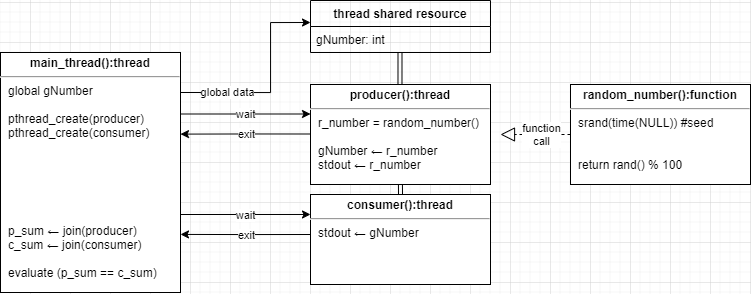
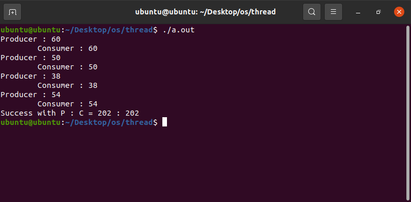

# Linux Operating System
Understanding Kernel and Interface with Linux Operating System 

## Environment

- Linux Ubuntu 20.04 (LTS)
- kernel 5.11.0-36-generic
- Bash
- gcc 9.3.0

## Multi-threading using POSIX standard API <pthread.h>

- System Flow

<p align="center">
  
</p>

- Result

<p align="center">
  
</p>

- Result in prompt

```bash
$ gcc multi_thread_shared_resource.c -lpthread
$ ./a.out

Producer : 12
    Consumer : 12
Producer : 82
    Consumer : 82
Producer : 17
    Consumer : 17
Producer : 32
    Consumer : 32
Producer : 55
    Consumer : 55
Success with P : C = 198 : 198
```
